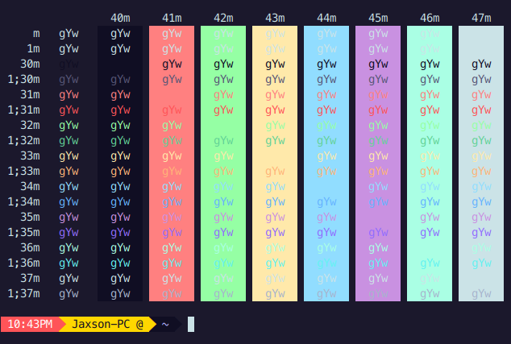
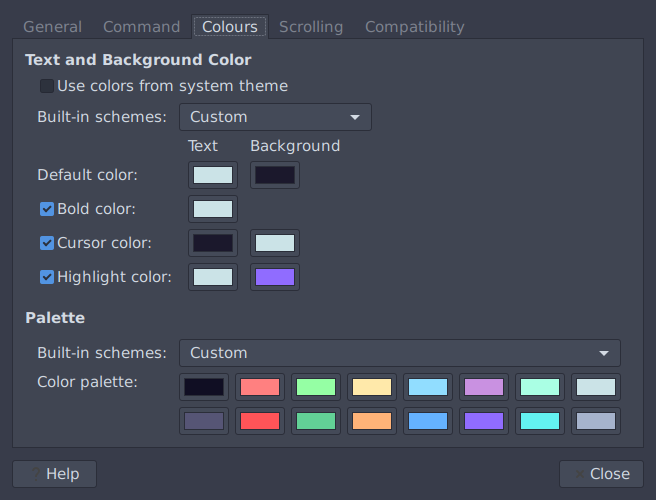

[](https://challenger-deep-theme.github.io/)
## [Challenger Deep Theme](https://challenger-deep-theme.github.io/) for [GNOME Terminal](https://help.gnome.org/users/gnome-terminal/stable/).

Original color scheme by [MaxSt](https://github.com/MaxSt) ported to [GNOME Terminal](https://help.gnome.org/users/gnome-terminal/stable/).






## Backing Up

To backup all settings from [GNOME Terminal](https://help.gnome.org/users/gnome-terminal/stable/), simply run the following:

```
dconf dump /org/gnome/terminal/legacy/ > backup.dconf
```

Then if you need to restore:

```
dconf load /org/gnome/terminal/legacy/ < backup.dconf
```


## Install using CURL script

To install this theme simply run the following command in the terminal:

```
curl -s https://raw.githubusercontent.com/challenger-deep-theme/gnome-terminal/master/remote-install.sh | bash
```

This will load the color palette into the default [GNOME Terminal](https://help.gnome.org/users/gnome-terminal/stable/) profile.

This will overwrite any previously defined color schemes in the terminal profile.

## Install manually

Alternatively, this repo can be cloned and run with the `install.sh` script.
